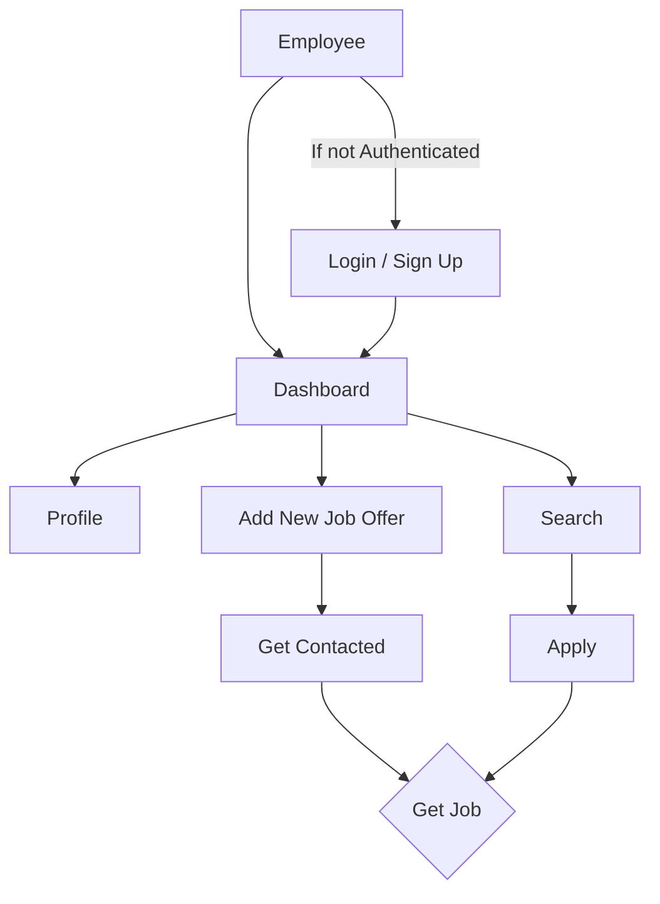
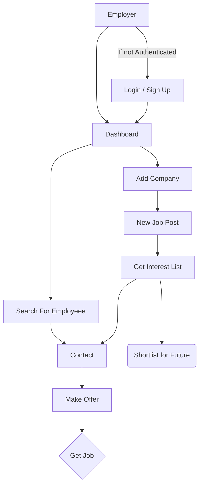

```mermaid
graph TD;
    E[Employee]--->|If not Authenticated| L[Login / Sign Up];
    E-->D[Dashboard];
    L-->D;
    D-->Profile;
    D-->Add_J[Add New Job Offer];
    D-->S[Search];
    S-->Apply;
    Add_J-->Cont[Get Contacted];
    Cont-->Job{Get Job};
    Apply-->Job;
```

```mermaid
graph TD;
   E[Employer]--->|If not Authenticated| L[Login / Sign Up];
   E-->D[Dashboard];
   L-->D;
   D-->A_C[Add Company];
   A_C-->New_J[New Job Post];
   D-->S[Search For Employeee];
   S-->Contact;
   Contact-->O[Make Offer];
   New_J-->In[Get Interest List];
   In--->Contact;
   In--->Sh(Shortlist for Future);
   O-->Job{Get Job};
```
